<h3><code>shreyash@github ~ $ ./contributions.sh</code></h3>

  

<h3><code>shreyash@github ~ $ whoami</code></h3>

<table>
<tr>
<td valign="top" width="40%"></td>
<td valign="top" width="60%"></td>
</tr>
</table>

I build backend services for financial and education products, from APIs and database queries to deployment. Outside work, I explore real-time systems, write C++, and solve competitive programming problems.

<h3><code>shreyash@github ~ $ ls projects/</code></h3>

| Project | What I built | Stack |
| --- | --- | --- |
| [Real-Time Fraud Detection & Risk Scoring Pipeline](https://github.com/ShreyashDhakate/Real-Time-Fraud-Detection) | Transaction features, recoverable stream processing, and gRPC risk scoring. | Python · Kafka · Redis · XGBoost · gRPC |
| [gambitd: Chess Engine & WebSocket Server](https://github.com/ShreyashDhakate/Chess-Engine) | A chess engine and WebSocket server, with tested move ordering and a Linux `epoll` event loop. | C++17 · Linux · WebSocket |
| [Concurrent Order Processing & Matching Service](https://github.com/ShreyashDhakate/Limit-Order-Book) | Order processing with mutex-guarded shared state, indexed cancellation and 47 correctness checks. | C++17 · HTTP · std::mutex |

<h3><code>shreyash@github ~ $ ./connect.sh</code></h3>

[Email](mailto:Shreyashgirdharidhakate@gmail.com) · [Repositories](https://github.com/ShreyashDhakate?tab=repositories)

Animated SVGs generated in this repository. Contribution refresh runs daily; the image shows its snapshot date and retains saved history when the feed has a different visibility.

